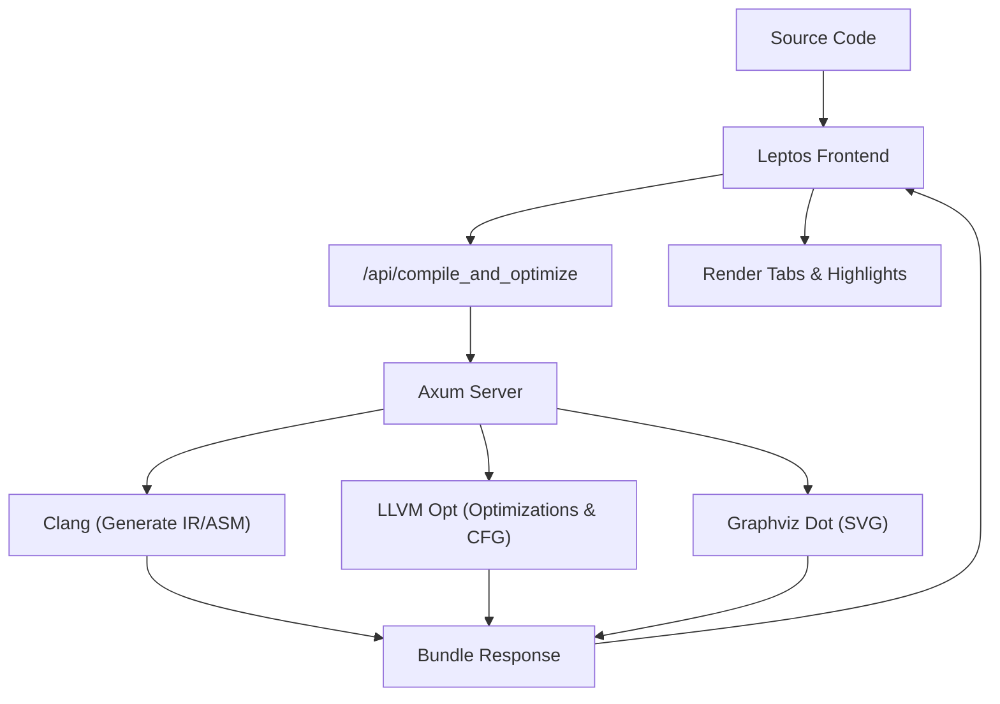
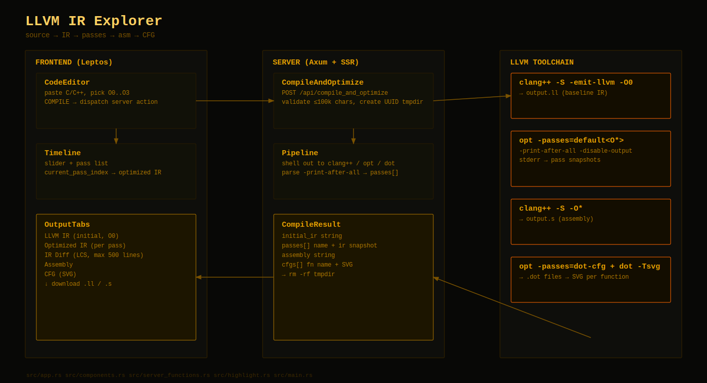

# LLVM IR Explorer

Most compiler tools show you the code before and after. This one shows you everything in between. Paste some C or C++, pick an optimization level, and watch as the compiler transforms your code pass-by-pass.

- **The Baseline**: Start with `-O0` IR. It’s raw, it’s verbose, and it’s the closest the compiler gets to your actual source before it starts "fixing" things.
- **Pass-by-Pass Timeline**: Use the slider to step through the optimization pipeline. You can see exactly which pass folded those constants or pruned that branch.
- **Visual Diffs**: We use a simple LCS diff to highlight what changed between the baseline and your current pass.
- **Assembly & CFG**: Check the final machine instructions or jump into the Control Flow Graphs (SVG) to see the shape of the logic.

## How it works

The frontend is a Leptos (Rust) app. When you hit compile, it triggers a server action on an Axum backend. The server creates a temporary workspace, runs the LLVM toolchain, and sends back a bundle of snapshots and graphs.

### Data Flow





Under the hood, we're calling:
1. `clang++ -S -emit-llvm -O0` for the baseline.
2. `opt -passes=default<O*> -print-after-all` to capture the pipeline.
3. `clang++ -S -O*` for the final assembly.
4. `opt -passes=dot-cfg` then `dot -Tsvg` for the graphs.

## LLVM background

LLVM IR is the "working language" of the compiler. It’s lower-level than C but much easier to read than assembly. It uses **Static Single Assignment (SSA)**, so every value (like `%1`) is assigned exactly once.

Optimization levels (like `-O2`) are basically just predefined pipelines of "passes"—individual programs that do one specific task like constant folding or dead code removal. This app pulls back the curtain on that process so you can see where the compiler makes its decisions.

A basic block is just a sequence of code with one entry and one exit. The CFG (Control Flow Graph) tab connects these blocks so you can visualize jumps and branches. It's helpful when IR gets too dense and you just want to see the shape of the logic.

## Setup

### Using Nix (recommended)
```bash
nix develop
cargo leptos watch
```
Open `http://localhost:3000`.

### Without Nix
You'll need Rust, `cargo-leptos`, `clang`, `llvm`, and `graphviz`.

On Debian/Ubuntu:
```bash
sudo apt-get install -y clang llvm graphviz
cargo install cargo-leptos
cargo leptos watch
```

### Docker
```bash
docker build -t llvm-ir-explorer .
docker run --rm -p 3000:3000 llvm-ir-explorer
```

## Notes
- Make sure `clang++`, `opt`, and `dot` are in your `$PATH`.
- Input limit: 100,000 characters.
