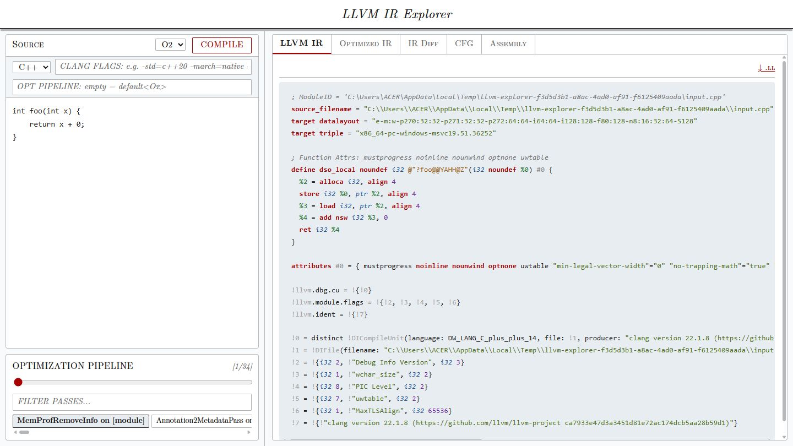

# IRAnatomy



IRAnatomy is a browser-based LLVM IR explorer for C and C++. It compiles source code, records the LLVM optimization pipeline, and displays the result through a compact interface styled after technical papers and LaTeX documents.

## Features

- Step through LLVM optimization passes and inspect the IR produced by each pass.
- Compare the selected pass against the original `-O0` IR or the preceding pass.
- View generated assembly and Graphviz control-flow graphs.
- Select C or C++, pass additional Clang flags, and provide a custom `opt` pipeline.
- Download IR and assembly output directly from the interface.

## Stack

The application uses Leptos with an Axum backend. Compilation and analysis are handled by `clang`, `clang++`, LLVM `opt`, and Graphviz `dot`.

## Run locally

The recommended setup uses Nix:

```bash
nix develop
cargo leptos watch
```

Without Nix, install Rust, `cargo-leptos`, Clang, LLVM, and Graphviz, then run:

```bash
cargo leptos watch
```

Open [http://localhost:3000](http://localhost:3000). Tool binaries must be available on `PATH`; LLVM binaries may instead be supplied through `LLVM_BIN_DIR`.

## Docker

```bash
docker build -t iranatomy .
docker run --rm -p 3000:3000 iranatomy
```
